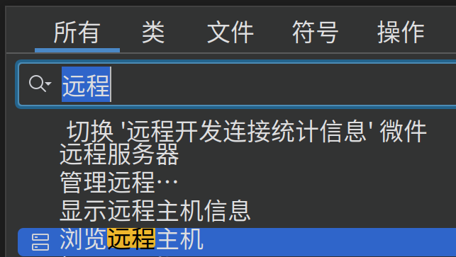
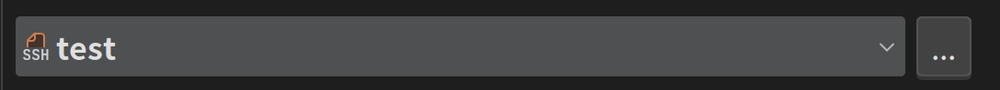

# 如何配置clion链接小电脑

* 打开“远程主机”，你可以双击shift在全局搜索中找到。



* 点击这三个点进入设置



* 点击左上角加号，创建一个新的SFTP服务器

* 随后点击ssh配置旁边的三个点，新建一个ssh配置

  

* ssh配置中按照以下配置填写：
  

* 点击测试连接，如果弹出成功即可。

* 

* 随后点击“映射”，配置本地路径和部署路径。本地路径就是当本机工程所在路径，部署路径是车上工作空间的路径，一般是```/home/dynamicx/rm_ws```。然后测试连接，如果连接成功，则配置没有问题。

  

* 随后远程主机页面出现车上的文件目录，配置完成✔

  