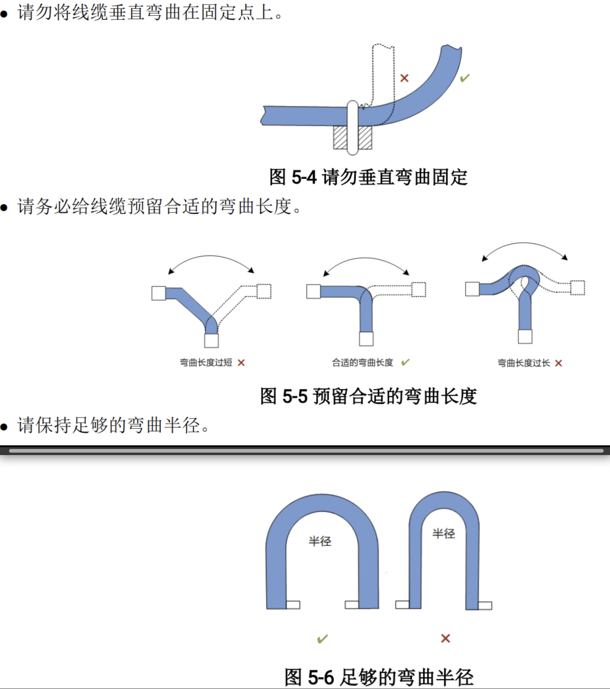
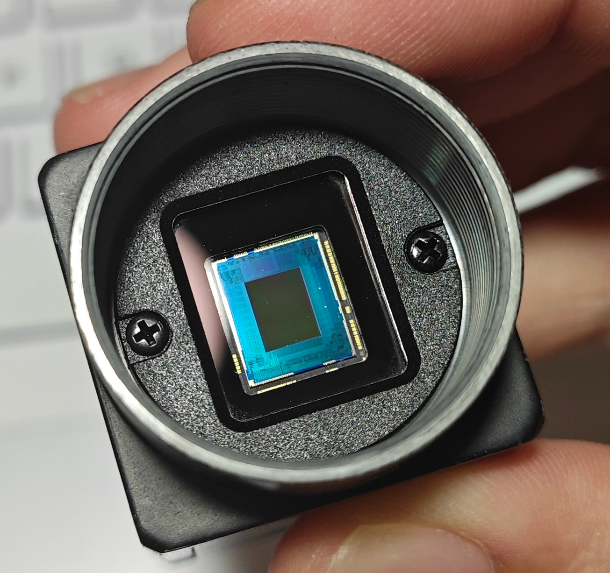

# hk_camera_note
### 这份文档主要记录我在25 26赛季使用海康相机时遇到的问题、解决办法以及总结的经验。参考了25赛季陈琦哥写的文档

---
# 相机类型
* 大海康有CA016(旧)，CS016(新)
* CA已经停产，CA/CS之间物理参数几乎一致，但在可用api、固件上有细微差别。
* 小海康是CB013
* 大恒不再建议使用。
* 相机镜头与相机本体的厂家尽量匹配。

# 相机物理安装
* 相机最好安装在铝件上，其次是板件。不建议安装在打印件上，26赛季的打印件相机底座出现了多次螺丝滑丝/固定不牢导致的相机松动。
* 安装在铝件上可以利用金属导热进行散热。若使用板件或打印件，可以贴散热鳍片。

  详情参照海康用户手册 “相机散热”。

# 相机线
* 相机线有普通、柔性、高柔和超柔四种规格，越往后弯折性能越好（也越贵）。普通车（英雄、正常尺寸的步哨、无人机、飞镖）等用普通线束就行，频繁弯折的工况（过洞步哨）用超柔。**这里不要省钱**。
  
  详情参考海康用户手册 “线缆选型”  
  
* 定制相机线：相机端接口/usb接口都是有方向的，定制线的时候跟商家讲清楚需要怎么弯折，最好发图片。
  
* 相机线usb接口很容易松，上场前用热熔胶粘死，或让机械加装固定打印件。

* 相机线束非常脆弱，走线不要过度弯折，**尤其是两个接口附近**。机械走完线之后最好自己检查一遍。普通、高柔两种材质的线都偏硬，不易弯折；需要大角度弯折建议换超柔的线材。

  详情参考海康用户手册 “布线原则”
  

# 更换相机

* 相机拆除镜头后露出cmos和玻璃挡板。玻璃挡板或镜头处进灰会导致成像不清晰。更换镜头的时候应尽量减少内部暴露的时间

反光的是玻璃挡板，挡板后面是图像传感器（cmos)。

#  如何检查相机

* **检查相机固定情况：**上下左右轻微晃动相机，看是否有明显位移。有则需要重新拧紧螺丝并重调光心

* **检查镜头松紧情况：**轻微拧动镜头看是否能拧松；如果能则需要拧紧后重新标定；如果同一个镜头几天内频繁出现松动的情况，用生料带缠绕镜头螺纹加紧。**缠绕方向和镜头拧紧的方向一致，注意不要挡住镜头进光孔**

  * 检查对焦螺丝：手拧对焦/光圈环，如果能拧动则撕开蓝丁胶，重新调整（对焦合适距离目标，光圈拉到最大直径，通常是数值2.8），拧紧后重新粘上蓝丁胶

* **检查相机图像：**寻找一个合适距离的目标（6mm镜头5-6m、8mm镜头8m、飞镖24m......总之就是平时打多远，就在多远的地方对焦)，从最小开始拧动对焦环，直到图像中物体边缘锐利；检查图像中是否有眩光/污点，有则需要清洁镜头；清洁后仍有污点则多半是镜头内部cmos处进灰

  **若无论如何拧对焦环都没法对上焦**：检查镜头对焦环是否松动（螺丝已经拧紧，但是对焦/光圈环仍可以前后、左右拧动），是则更换镜头；如果更换镜头仍然模糊，多是cmos松了，送修。

  **若对焦环松动但没有多余镜头**，可通过移除镜头螺纹旁的三颗银色十字螺丝拆开镜头，拧紧内部的三颗黑色十字螺丝重新固定对焦环。

* **检查帧率：**车上reboot/restart，查看image_raw帧率；单跑前相机通常160+，和济瞄一起跑一般130-150，后相机通常限制帧率至15-30.

  若单跑前置满帧只有152/掉帧明显比其他车严重：检查**海康SDK版本**是否为22版（MVS-2.1.1_x86_64_20220511）,24版SDK帧数仅有120-150帧。

  若前置帧率为24+/图像撕裂/彩色坏点：插了usb2.0；或usb接口没插紧，将usb3.0识别为了2.0。

* 识别效果不佳查不到原因，可先尝试清洁镜头和亚克力。不要用手擦。

* 不要在开着rqt看compressed的时候读话题的帧率。

# 小相机的注意事项
* 小相机（CB013）没有螺纹孔固定接口，要额外加装打印件固定。
* 小相机的工作温度高，打印件背部需要镂空提供散热。
* 小相机镜头螺纹没有限位，不能直接拧到底，容易划伤cmos的玻璃挡板。
* 小相机镜头固定螺丝很容易松，拧紧。
* 小相机底噪大，调高gamma后画面质量很差。

# MVS SDK
* 目前在用`MVS-2.1.1_x86_64_20220511`(22年)
* 24年驱动相机帧数跑不满
* 但22驱动已经很旧，建议尝试换新的SDK

# hk_camera

### 录相机图像
* 直接录制hk_camera/image_raw录下来的bag会相当巨大。
* 录制hk_camera/image_raw/compressed会导致相机原图像掉帧。
* fps_down模式是为了能够获取赛场图像写的参数，发送hk_camera/image_raw_down/compressed用于录制。
* fps_down模式目前会导致原图像掉帧，严重程度随fps_down的录制帧数递增。因此目前会将target_fps设置为15-20帧。

### compressed原理
image_raw传给ros后进行处理(硬编码)压缩图像后给到compressed

* Tips:相机的compressed不要动 ==(不能听,不能用plotjuggler加载,rqt里不能一直看(看一眼可以))== ——因为听完之后别的话题帧率会下降(特别是相机的image_raw的帧率会爆降)

## 把compressed话题转成raw

`rosrun image_transport republish compressed in:=/hk_camera/image_raw raw out:=/hk_camera/image_raw`(话题名字没错)

* compressed：指定输入图像的类型为压缩（sensor_msgs/CompressedImage）
* in:=/hk_camera/image_raw：输入话题的基名称(base topic)。实际订阅的话题是 /hk_camera/image_raw/compressed(自动加上类型后缀) 
* raw：输出图像的类型为原始格式(sensor_msgs/Image)
* out:=/hk_camera/camera/image_raw：输出话题的基名称

**WARNING**：不要在本地听帧率
在本地rostopic hz 相机及其处理节点topic帧率会骤降，要wired上车再看帧率

**WARNING**：rostopic hz为滑动窗口计数，帧数变化有延迟。读当前帧率应重新跑rostopic hz

**不要在rqt里看topic的帧率，也不要开着rqt听帧率**
rqt会降帧率

### 曝光度(exposure_value)的实质

本质上是曝光时间（快门速度），曝光时间+处理时间=一帧的时间

相机上限166帧，1s/166=6024μs，因此当一帧的时间大于6024μs时就会跑不满。

实测减去处理时间后，曝光时间（曝光值）>5000就会掉帧。

若曝光时间过长->会产生拖影

**WARNING**:相机的compressed不要动 ==(不能rostopic hz,不能plotjuggler加载,rqt里不能一直看(看一眼可以))== ——因为听完之后别的话题帧率会下降(特别是相机的image_raw的帧率会爆降)

## 相机帧率异常 常见原因(大相机)

* 原则：从硬件到软件、从简单到复杂检查

| 原因                                                         | 常见异常帧数       |
| ------------------------------------------------------------ | ------------------ |
| 相机线坏了                                                   | 0                  |
| 接口是USB2.0 或线没插紧                                      | 28+                |
| 接口坏了                                                     | 0/28+              |
| 相机坏了                                                     | 0                  |
| 订阅了compressed(一般是控制直接在plotjuggler全拉话题导致),或者rqt开着compressed图像 | 90-110             |
| 在录包(相机image_raw或者compressed话题)                      | 70-110             |
| 用了24年驱动                                                 | 120-150            |
| 电脑温度过高(`sensors`看一下)                                |                    |
| 占用过高（`top`找`xx.x id`，xx.x代表当前cpu空闲的比例 / 或者看`htop`） |                    |
| 硬盘满了                                                     | 原因不明的跑不起来 |

### 查错误码

* 查MvErrorDefine.h
* 碰到报错看不懂，复制报错翻代码

